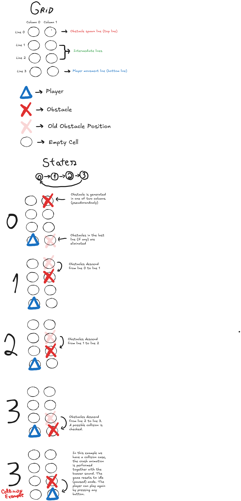
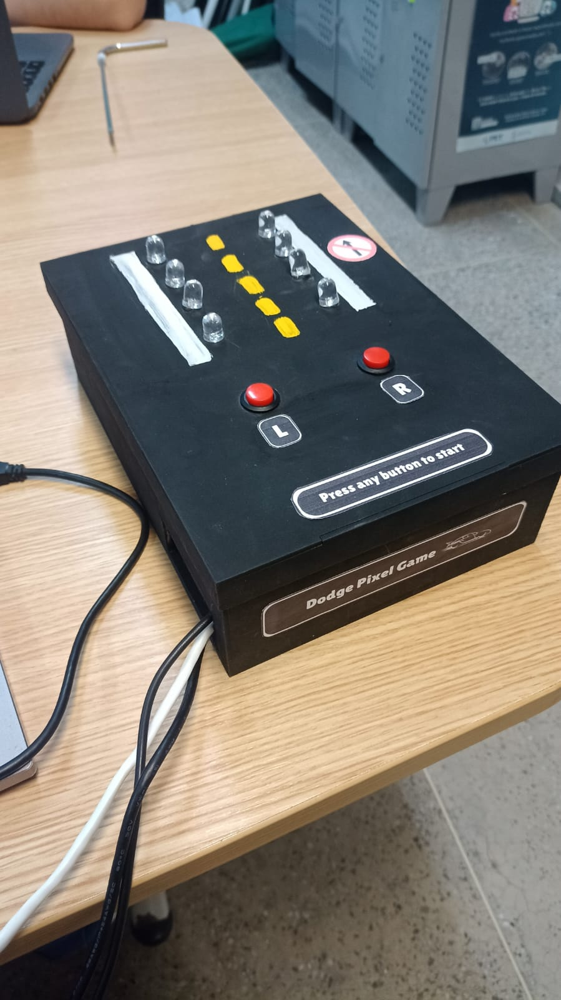
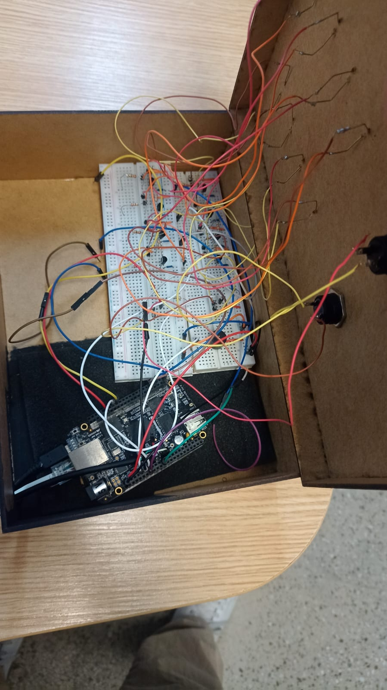

# **Dodge Pixel - Jogo Arcade de Corrida Infinita**

## **Descrição do Projeto**

Dodge Pixel é um jogo de corrida infinita desenvolvido para a plataforma **Beaglebone Black** em baremetal (sem sistema operacional). O jogo acontece em um grid de LEDs de 4x2, onde o jogador controla um personagem na última linha (linha 3) e deve desviar de obstáculos que descem pela tela. 

O jogador pode se mover para a esquerda ou direita através de dois botões. O jogo começa pausado e, ao pressionar qualquer botão, o jogo inicia. Obstáculos são gerados aleatoriamente no topo do grid e descem até que uma colisão ocorra, momento em que o jogo pausa e um alerta sonoro é emitido.

## **Funcionamento do Jogo**

- **Tela de Jogo**: A interface do jogo é um grid de LEDs com 4 linhas e 2 colunas:
  - Linha 0 (topo)
  - Linhas 1 e 2
  - Linha 3 (base) — Onde o personagem fica fixo
  - Colunas 0 (esquerda) e Coluna 1 (direita)

- **Movimentação**: O personagem só se move horizontalmente na última linha (linha 3). Dois botões controlam o movimento:
  - Botão Esquerda: Move o personagem para a coluna 0.
  - Botão Direita: Move o personagem para a coluna 1.

- **Estados do Jogo**:
  1. **Estado Zero**: Um obstáculo é gerado na linha 0 (coluna aleatória).
  2. **Estado Um**: O obstáculo desce para a linha 1.
  3. **Estado Dois**: O obstáculo desce para a linha 2.
  4. **Estado Três**: O obstáculo desce para a linha 3. Se houver colisão com o personagem, o buzzer é ativado e o jogo volta para o modo pausado.

- **Aleatoriedade**: A posição do obstáculo é gerada através de um algoritmo **XORSHIFT**. A seed para o algoritmo é obtida do valor presente no registrador do **TIMER7** (DMTIMER_TCRR) no momento em que o jogador pressiona o botão para iniciar o jogo pela primeira vez.

- **Início e Pausa**: O jogo inicia pausado, e pode ser iniciado pressionando qualquer um dos botões de controle. Ao colidir com um obstáculo, o buzzer é acionado e o jogo retorna ao estado pausado.

## **Notes**

## **Algoritmo XORSHIFT**

O **XORSHIFT** é um algoritmo eficiente de geração de números pseudo-aleatórios, muito utilizado em sistemas embarcados por sua simplicidade e velocidade. Ele utiliza operações de deslocamento e XOR para transformar um valor inicial (seed) em uma sequência de números pseudo-aleatórios.

No Dodge Pixel, a seed é obtida do valor do registrador **DMTIMER_TCRR** no momento do primeiro clique do jogador, garantindo uma aleatoriedade baseada no tempo de inicialização do sistema.

## **Hardware Utilizado**

- **Beaglebone Black:** Sistema embarcado no qual o jogo foi desenvolvido.
- **LEDs:** Utilizados para representar o grid do jogo (4 linhas por 2 colunas). Cada LED indica a posição de um obstáculo ou do personagem no jogo, piscando ou acendendo conforme o estado.
- **Botões:** Dois botões físicos são utilizados para controlar a movimentação do jogador. Um botão move o personagem para a esquerda (Coluna 0) e o outro move para a direita (Coluna 1).
- **Buzzer Ativo:** Dispositivo sonoro que emite um sinal quando uma colisão ocorre. Um buzzer ativo é um tipo de buzzer que possui um circuito embutido para gerar som, bastando fornecer tensão para ativá-lo, diferentemente dos buzzers passivos, que requerem um sinal de controle.
- **Resistores de 220 Ω:** São utilizados em série com os LEDs para limitar a corrente, protegendo tanto os LEDs quanto o circuito de possíveis sobrecargas.
- **Resistores de 1k Ω:** Utilizados nos botões para garantir que o circuito esteja corretamente polarizado, evitando leituras incorretas (falsos sinais) causados por ruídos no sistema.
- **Jumpers:** Fios de conexão utilizados para interligar os componentes do circuito, como o Beaglebone Black, LEDs, botões, buzzer e transistores. Eles são essenciais para fazer as conexões elétricas necessárias no protoboard.
- **Transistores 2N2222:** Pequenos transistores NPN utilizados para amplificar ou comutar sinais no circuito. No projeto, eles podem ser usados para controlar a ativação dos LEDs, fornecendo a corrente necessária.

## **Conceitos Abordados**

### **GPIO**
As portas **GPIO** da Beaglebone Black foram configuradas para controlar os LEDs do grid de 4x2, buzzer e também para ler o estado dos botões que movem o personagem.

### **TIMER**
O **TIMER7** da Beaglebone é utilizado tanto para gerar a seed do algoritmo de aleatoriedade quanto para controlar o tempo de execução do jogo.

### **UART**
A **UART** foi configurada para fornecer logs durante o desenvolvimento, facilitando o processo de debug e compreensão do funcionamento do sistema em tempo real.

### **Interrupções**
Interrupções foram configuradas para os dois botões de controle do personagem, garantindo que o jogo responda rapidamente às ações do jogador, mesmo em um ambiente baremetal.

Aqui está a versão refatorada da seção:

---

## **Como Rodar o Projeto**

Para executar o projeto, você precisará dos componentes necessários para o circuito, além de uma placa de desenvolvimento **Beaglebone Black**. Também é necessário configurar um ambiente de cross-compilação para desenvolver e compilar o código baremetal.

### **Passos para execução:**

1. **Configuração do Ambiente**: Configure o ambiente de desenvolvimento em seu computador. Isso inclui a instalação do compilador adequado para ARM e a configuração da comunicação com a Beaglebone Black.
   
2. **Montagem do Circuito**: Monte o circuito conforme as especificações do projeto, incluindo LEDs, botões, resistores e o buzzer.

3. **Transferência do Código**:
   - Use o **Minicom** para estabelecer comunicação serial com a Beaglebone Black e monitorar o console.
   - Utilize o **TFTP** como protocolo para transferir o binário compilado para a Beaglebone.

A maneira recomendada para comunicação serial é via **Minicom**, enquanto o **TFTP** facilita a transferência rápida de arquivos. Para mais detalhes sobre a instalação do ambiente baremetal e configuração, consulte o tutorial disponível no repositório:

- [Como instalar o ambiente de desenvolvimento Baremetal da Beaglebone?](https://github.com/PabloVini28/PTES01/blob/main/Documents/ENVIRONMENT_INSTALLATION_TUTORIAL.pdf)

## **Resultados**

## **Contribuição**

Contribuições são bem-vindas! Para reportar bugs ou sugerir melhorias, utilize o sistema de issues deste repositório.

## **Licença**

Este projeto está licenciado sob a MIT License.