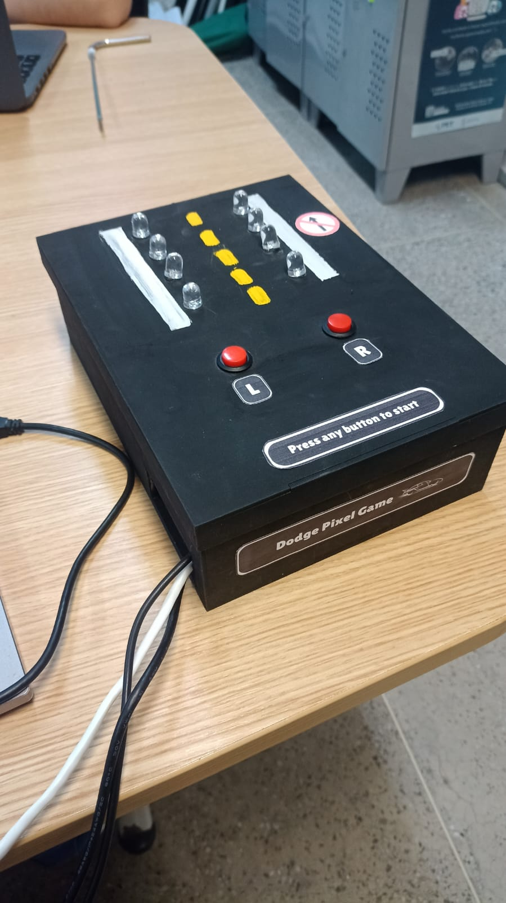

# **Dodge Pixel - Infinite Racing Arcade Game**

## **Project Description**

Dodge Pixel is an infinite racing game developed for the **Beaglebone Black** platform in baremetal (no operating system). The game takes place on a 4x2 LED grid, where the player controls a character on the bottom row (row 3) and must dodge obstacles that descend from the top of the screen.

The player can move left or right using two buttons. The game starts paused, and pressing any button begins the action. Obstacles are randomly generated at the top of the grid and descend until a collision occurs, at which point the game pauses and an alert sound is emitted.

## **Gameplay Mechanics**

- **Game Screen**: The game interface is a 4x2 LED grid:
  - Row 0 (top)
  - Rows 1 and 2
  - Row 3 (base) — Where the character is fixed
  - Column 0 (left) and Column 1 (right)

- **Movement**: The character only moves horizontally on the bottom row (row 3). Two buttons control the movement:
  - Left Button: Moves the character to column 0.
  - Right Button: Moves the character to column 1.

- **Game States**:
  1. **State Zero**: An obstacle is generated in row 0 (random column).
  2. **State One**: The obstacle descends to row 1.
  3. **State Two**: The obstacle descends to row 2.
  4. **State Three**: The obstacle descends to row 3. If a collision occurs with the character, the buzzer is activated, and the game returns to the paused state.

- **Randomness**: The obstacle's position is generated using the **XORSHIFT** algorithm. The seed for the algorithm is obtained from the value present in the **TIMER7** register (DMTIMER_TCRR) when the player presses the button to start the game for the first time.

- **Start and Pause**: The game starts paused and can be initiated by pressing any of the control buttons. Upon colliding with an obstacle, the buzzer sounds, and the game returns to the paused state.

## **Notes**

## **XORSHIFT Algorithm**

The **XORSHIFT** is an efficient pseudo-random number generation algorithm, widely used in embedded systems due to its simplicity and speed. It utilizes shift and XOR operations to transform an initial value (seed) into a sequence of pseudo-random numbers.

In Dodge Pixel, the seed is obtained from the **DMTIMER_TCRR** register value at the moment of the player's first click, ensuring randomness based on the system's initialization time.

## **Hardware Used**

- **Beaglebone Black:** The embedded system on which the game was developed.
- **LEDs:** Used to represent the game grid (4 rows by 2 columns). Each LED indicates the position of an obstacle or the character in the game, blinking or lighting up according to the state.
- **Buttons:** Two physical buttons are used to control the player's movement. One button moves the character to the left (Column 0) and the other moves it to the right (Column 1).
- **Active Buzzer:** A sound device that emits a signal when a collision occurs. An active buzzer has a built-in circuit to generate sound, requiring only voltage to activate, unlike passive buzzers, which need a control signal.
- **220 Ω Resistors:** Used in series with the LEDs to limit current, protecting both the LEDs and the circuit from potential overloads.
- **1k Ω Resistors:** Used on the buttons to ensure proper circuit polarization, preventing incorrect readings (false signals) caused by system noise.
- **Jumpers:** Connection wires used to interconnect circuit components, such as the Beaglebone Black, LEDs, buttons, buzzer, and transistors. They are essential for making the necessary electrical connections on the protoboard.
- **2N2222 Transistors:** Small NPN transistors used to amplify or switch signals in the circuit. In the project, they may be used to control LED activation, providing the necessary current.

## **Concepts Covered**

### **GPIO**
The **GPIO** ports of the Beaglebone Black were configured to control the 4x2 LED grid, buzzer, and to read the state of the buttons that move the character.

### **TIMER**
The **TIMER7** of the Beaglebone is used both to generate the seed for the randomness algorithm and to control the game's execution timing.

### **UART**
The **UART** was configured to provide logs during development, facilitating the debugging process and understanding the system's functioning in real-time.

### **Interrupts**
Interrupts were configured for the two control buttons of the character, ensuring that the game responds quickly to player actions, even in a baremetal environment.

## **How to Run the Project**

To execute the project, you will need the necessary components for the circuit, in addition to a **Beaglebone Black** development board. A cross-compilation environment must also be set up to develop and compile the baremetal code.

### **Steps to Execute:**

1. **Environment Setup**: Configure the development environment on your computer. This includes installing the appropriate ARM compiler and setting up communication with the Beaglebone Black.
   
2. **Circuit Assembly**: Assemble the circuit according to the project specifications, including LEDs, buttons, resistors, and the buzzer.

3. **Code Transfer**:
   - Use **Minicom** to establish serial communication with the Beaglebone Black and monitor the console.
   - Use **TFTP** as a protocol to transfer the compiled binary to the Beaglebone.

The recommended method for serial communication is via **Minicom**, while **TFTP** facilitates quick file transfers. For more details on setting up the baremetal environment and configuration, consult the tutorial available in the repository:

- [How to Install the Baremetal Development Environment for Beaglebone?](https://github.com/PabloVini28/PTES01/blob/main/Documents/ENVIRONMENT_INSTALLATION_TUTORIAL.pdf)

## **Results**

## **Contributing**

Contributions are welcome! To report bugs or suggest improvements, please use the issue tracker of this repository.

## **License**

This project is licensed under the MIT License.